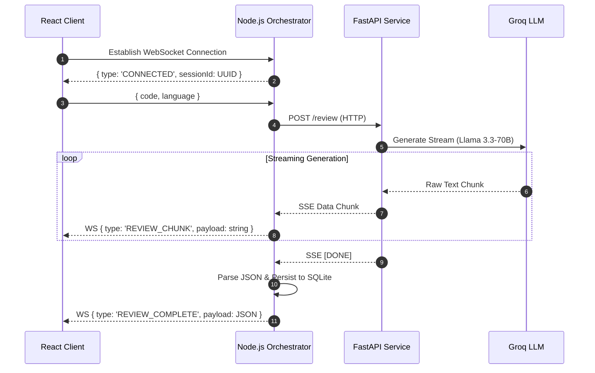

# AI-Code-Review-Bot: Real-time, polyglot code analysis.

A highly responsive, intelligent code review platform that provides zero-latency, streaming feedback on source code across multiple programming languages.

## Architecture Overview

The system is designed as a highly scalable **3-tier architecture**, prioritizing real-time feedback and clear separation of concerns:

1. **Frontend (React + TypeScript):** A sleek, polyglot editor interface utilizing Monaco Editor for a native IDE feel.
2. **Orchestrator (Node.js + TypeScript):** The central state manager that handles persistent WebSocket connections, acts as an API gateway, and persists historical sessions.
3. **AI Service (Python + FastAPI):** A dedicated microservice handling asynchronous LLM interactions. It utilizes the **Groq API (Llama 3.3-70B)** to achieve lightning-fast inference and streams structured JSON responses via Server-Sent Events (SSE).

## Key Features

- **Real-Time Streaming:** Seamlessly integrates native WebSockets and Server-Sent Events (SSE) to pipe AI feedback directly from the LLM down to the client with near-zero latency.
- **Polyglot Support:** Accurately processes and reviews code in Go, Python, Java, JavaScript, and TypeScript.
- **Monaco Editor Integration:** Provides a rich, native IDE experience featuring inline annotations, context-aware hover tooltips, and severity-colored gutters for bugs, security vulnerabilities, and style issues.
- **Session Persistence:** Leverages `better-sqlite3` to securely store historical review sessions, allowing users to asynchronously reload past snippets and feedback via the sidebar.

## WebSocket Flow

The core value proposition relies on bypassing the standard request-response HTTP cycle in favor of full-duplex streams.



## Tech Stack

- **AI Service:** Python, FastAPI, Groq (Llama-3.3-70b-versatile)
- **Backend:** Node.js, TypeScript, `ws` (WebSockets), `better-sqlite3`
- **Frontend:** React, TypeScript, Vite, Monaco Editor, Tailwind CSS v4, Lucide Icons

## Setup Instructions

Ensure you have **Node.js (v18+)** and **Python 3.10+** installed.

### 1. Setup the AI Service (Python)
Navigate to the AI service directory and install the required dependencies:
```bash
cd ai-service
python -m venv venv
source venv/bin/activate  # On Windows: venv\Scripts\activate
pip install -r requirements.txt
```
Start the FastAPI server:
```bash
fastapi dev main.py
```

### 2. Setup the Backend Orchestrator (Node.js)
Navigate to the backend directory and start the orchestrator:
```bash
cd backend
npm install
npm run dev
```

### 3. Setup the Frontend (React)
Navigate to the frontend directory and start the Vite development server:
```bash
cd frontend
npm install
npm run dev
```

## Environment Variables

You must configure the `.env` files in their respective directories before starting the services.

**`/ai-service/.env`**
```env
# Groq API Key for LLM Inference
GROQ_API_KEY=gsk_your_groq_api_key_here
```

**`/backend/.env`**
```env
# HTTP Port for the Backend Service
PORT=3000

# URI of the Python AI Microservice
PYTHON_SERVICE_URL=http://localhost:8000
```

**`/frontend/.env`**
```env
# URLs targeting the Node.js Backend
VITE_WS_URL=ws://localhost:3000
VITE_API_URL=http://localhost:3000
```
